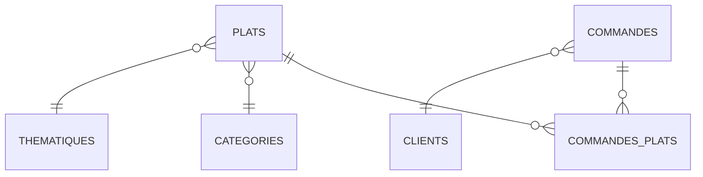

# Plan Base de Données

Analyse et planifie les évolutions du schéma **sans exécuter de migrations**.

## État actuel (tables)

- `plats`, `categories`, `thematiques`, `ingrediants`, `temp_preparations`, `prix`
- `clients`, `commandes`, `commandes_plats` (pivot incomplet), `statuts`

## Lacunes connues

- `commandes_plats` : manque probablement `commande_id`, `plat_id`, `quantite`, `prix_unitaire`
- `plats` : manque FK vers categorie, thematique, prix, temp_preparation
- `commandes` : lien `client_id`, cohérence `statut` string vs `statut_id`

## Livrable plan

1. **Diagramme relations** (texte ou mermaid)
2. **Liste migrations** à créer (une migration = un concern)
3. **Modifications models** : relations, `$fillable`, casts
4. **Seeders** : données démo marocaines
5. **Ordre d'exécution** : `migrate` puis `db:seed`

## Règles migrations

- Ne jamais éditer une migration déjà exécutée
- FK avec `constrained()` et `cascadeOnDelete` où pertinent
- Index sur `commandes.created_at`, `commandes.statut`

## Exemple mermaid attendu

**Attendre validation avant créer les migrations.**
